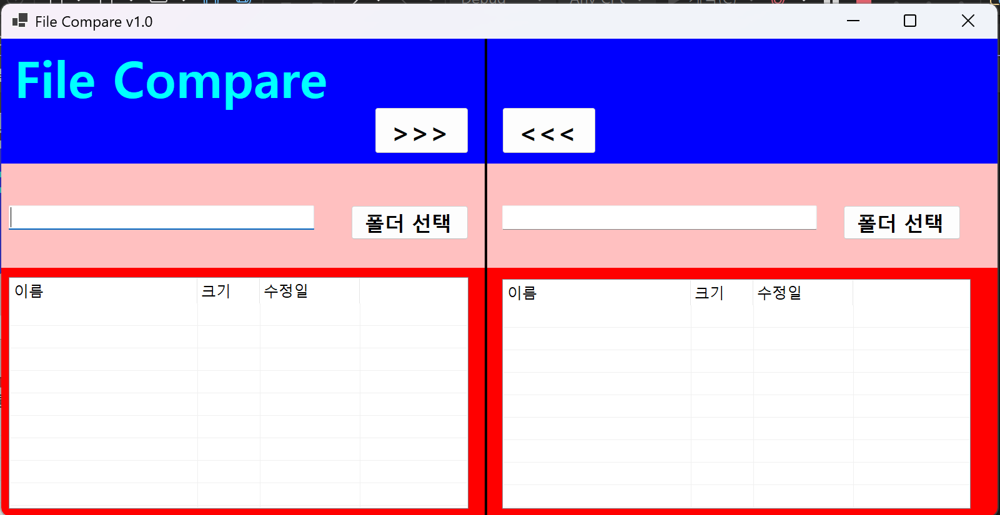

# (C# 코딩) 파일 비교 툴 (File Compare)

## 개요
- C# 프로그래밍 학습**: `DirectoryInfo`와 `FileInfo` 클래스를 활용한 파일 시스템 탐색 및 `ListView` 컨트롤 제어 학습
- 1줄 소개: 두 폴더의 파일 목록을 비교하여 최신 버전 여부를 색상으로 시각화하고 동기화하는 도구
- 사용한 플랫폼: 
	- C#, .NET Windows Forms, Visual Studio, GitHub
- 사용한 컨트롤:
	- Label, TextBox, ListView, Button, SplitContainer, FolderBrowserDialog
- 사용한 기술과 구현한 기능:
	- `System.IO` 네임스페이스를 활용한 파일 및 디렉터리 정보 추출
	- `ListView`의 `Details` 뷰 모드 및 `SubItems`를 이용한 다중 컬럼 데이터 표시
	- `try-catch` 구문을 활용한 입출력 예외 처리 및 폴더 접근 보안 강화

---

## 실행 화면 (과제1)
- 코드의 실행 스크린샷과 구현 내용 설명

- 구현한 내용 (위 그림 참조)**
	- UI 디자인: `SplitContainer`를 활용하여 좌우 폴더 목록을 대칭으로 배치하고, 각 측에 `ListView`를 배치하여 윈도우 탐색기와 유사한 인터페이스 구현
	- 기초 컨트롤 활용: `Label`, `TextBox`, `Button`을 사용하여 폴더 경로 표시 및 사용자 인터페이스 구성
	- 기능 구현: `FolderBrowserDialog`를 통해 사용자가 탐색할 폴더를 선택하고, 해당 경로를 텍스트박스에 반영하는 기능 구현

---

## 실행 화면 (과제2)
- 코드의 실행 스크린샷과 구현 내용 설명

- 구현한 내용 (위 그림 참조)
   

---

## 실행 화면 (과제3)
- 코드의 실행 스크린샷과 구현 내용 설명

- 구현한 내용 (위 그림 참조)
    - (과제 3 완료 후 작성 예정)

---

## 실행 화면 (과제4)
- 코드의 실행 스크린샷과 구현 내용 설명

- 구현한 내용 (위 그림 참조)
    - (과제 4 완료 후 작성 예정)