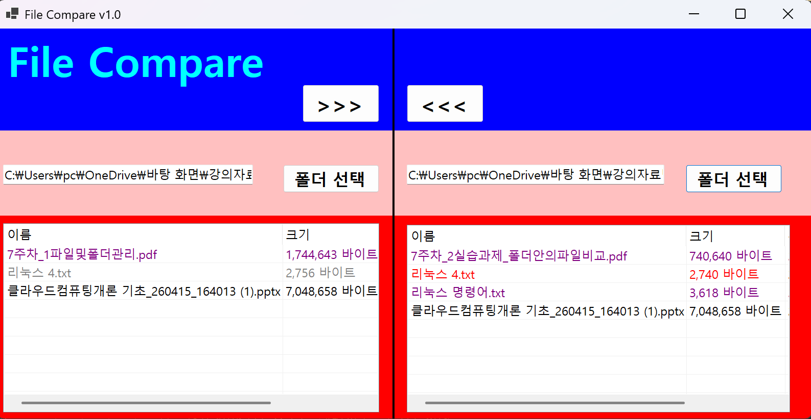
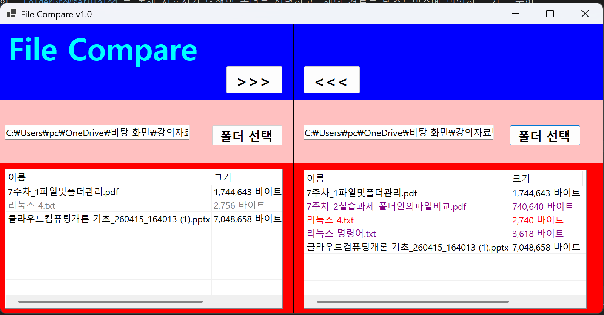
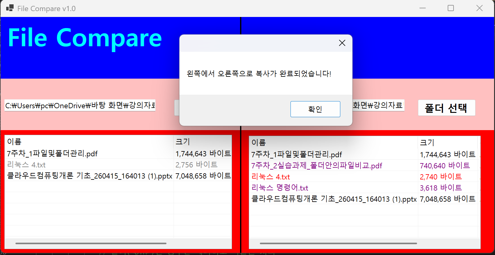
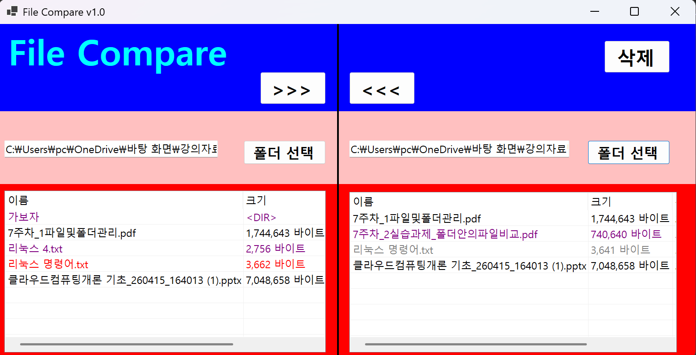
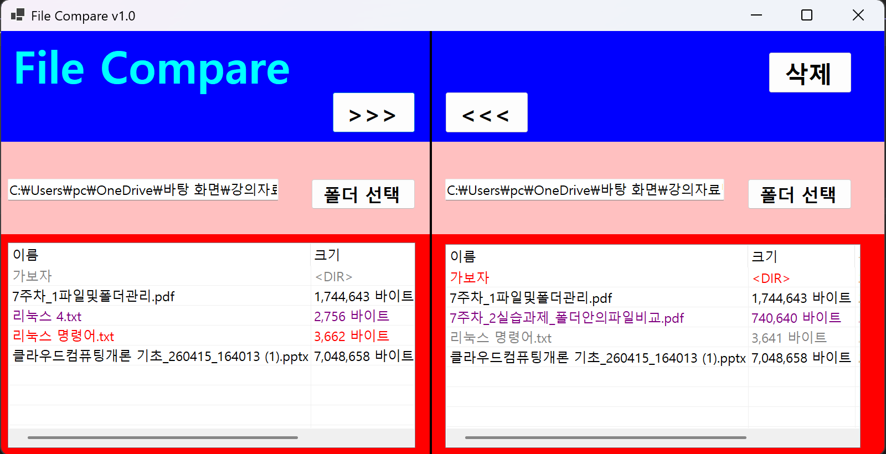

# (C# 코딩) 파일 비교 툴 (File Compare)

## 개요
- C# 프로그래밍 학습**: `DirectoryInfo`와 `FileInfo` 클래스를 활용한 파일 시스템 탐색 및 `ListView` 컨트롤 제어 학습
- 1줄 소개: 두 폴더의 파일 목록을 비교하여 최신 버전 여부를 색상으로 시각화하고 동기화하는 도구
- 사용한 플랫폼: 
	- C#, .NET Windows Forms, Visual Studio, GitHub
- 사용한 컨트롤:
	- Label, TextBox, ListView, Button, SplitContainer, FolderBrowserDialog
- 사용한 기술과 구현한 기능:
	- `System.IO` 네임스페이스를 활용한 파일 및 디렉터리 정보 추출
	- `ListView`의 `Details` 뷰 모드 및 `SubItems`를 이용한 다중 컬럼 데이터 표시
	- `try-catch` 구문을 활용한 입출력 예외 처리 및 폴더 접근 보안 강화

---

## 실행 화면 (과제1)
- 코드의 실행 스크린샷과 구현 내용 설명

- 구현한 내용 (위 그림 참조)**
	- UI 디자인: `SplitContainer`를 활용하여 좌우 폴더 목록을 대칭으로 배치하고, 각 측에 `ListView`를 배치하여 윈도우 탐색기와 유사한 인터페이스 구현
	- 기초 컨트롤 활용: `Label`, `TextBox`, `Button`을 사용하여 폴더 경로 표시 및 사용자 인터페이스 구성
	- 기능 구현: `FolderBrowserDialog`를 통해 사용자가 탐색할 폴더를 선택하고, 해당 경로를 텍스트박스에 반영하는 기능 구현

---

## 실행 화면 (과제2)
- 코드의 실행 스크린샷과 구현 내용 설명

- 구현한 내용 (위 그림 참조)
    - 파일 리스트 출력: `Directory.EnumerateFiles`를 사용하여 선택된 폴더 내의 파일 이름, 크기, 수정 시간을 `ListView`에 실시간으로 표시
    - 비교 로직 구현: 양쪽 폴더의 파일 이름과 `LastWriteTime`(수정 시간)을 대조하여 파일의 상태를 결정
    - 색상 구분 표시 (핵심 기능):
        - 검은색: 이름과 수정 시간이 완벽하게 일치하는 동일 파일
        - 빨간색 (New): 상대방 폴더의 파일보다 수정 시간이 최신인 파일
        - 회색 (Old): 상대방 폴더의 파일보다 수정 시간이 오래된 파일
        - 보라색 (단독): 상대방 폴더에는 존재하지 않는 해당 폴더만의 단독 파일
    - 동적 UI 업데이트: 폴더 경로가 변경될 때마다 자동으로 비교 로직을 실행하여 실시간으로 파일 상태(색상) 갱신
   

---

## 실행 화면 (과제3)
- 코드의 실행 스크린샷과 구현 내용 설명

- 구현한 내용 (위 그림 참조)
    - 구현한 내용 (위 그림 참조)
    - 양방향 파일 복사 기능: `btnCopyFromLeft`(>>>)와 `btnCopyFromRight`(<<<) 버튼을 통해 선택한 파일을 반대편 폴더로 전송하는 기능을 구현하였습니다.
    - 파일 동기화 및 덮어쓰기: `File.Copy` 메서드의 `overwrite` 매개변수를 `true`로 설정하여, 구버전 파일(회색)이나 단독 파일(보라색)을 최신 상태로 즉시 업데이트할 수 있도록 하였습니다.
    - 실시간 상태 업데이트: 복사가 완료된 후 `PopulateListView`와 `CompareFiles` 함수를 재호출하여, 양쪽 폴더의 파일 상태가 '동일(검은색)'로 변경되는 것을 시각적으로 즉시 확인할 수 있게 설계하였습니다.
    - 예외 처리 및 안전성: 파일 복사 중 발생할 수 있는 접근 권한 문제나 파일 사용 중 오류를 `try-catch` 문으로 제어하여 프로그램의 중단 없이 안정적인 동작이 가능하도록 구현하였습니다.

---

## 실행 화면 (과제4)
- 코드의 실행 스크린샷과 구현 내용 설명

- 구현한 내용 (위 그림 참조)
    - 구현한 내용 (위 그림 참조)
    - 재귀적 폴더 복사(Recursive Copy): 단순 파일 복사를 넘어, 하위 디렉터리와 그 내부의 모든 파일까지 통째로 복사하는 `CopyDirectory` 재귀 함수를 구현하였습니다.
    - 디렉터리 생성 및 관리: 대상 경로에 폴더가 존재하지 않을 경우 `Directory.CreateDirectory`를 통해 자동으로 구조를 생성하도록 설계하였습니다.
    - 파일 및 폴더 삭제 기능: `File.Delete`와 `Directory.Delete(path, true)`를 활용하여, 불필요한 항목을 프로그램 내에서 즉시 제거하고 리스트를 동기화하는 기능을 추가하였습니다.
    - 최종 동기화 완성: 양방향 복사와 삭제 기능을 통해 두 폴더의 내용을 완벽하게 일치시킬 수 있는 파일 비교 및 동기화 툴을 완성하였습니다.